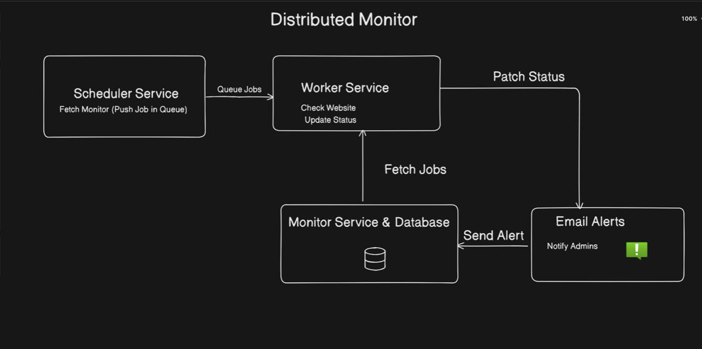

A production-grade, microservices-based uptime monitoring system — built to scale.



---

##  Why This Exists

Most uptime monitors are monoliths — one server polls URLs, sends alerts, and stores results. That works until it doesn't: one slow URL times out and blocks the entire queue, or a spike in registered sites takes down the whole service.

**Distributed Monitor** solves this by splitting every concern into its own independent service, connected via a Redis-backed BullMQ task queue. Each service can fail, restart, or scale independently without taking down the rest of the system.

---

## 🏗️ Architecture

```
┌─────────────────────────────────────────────────────────┐
│                    scheduler-service                     │
│         Cron jobs → pushes check tasks to queue         │
└──────────────────────┬──────────────────────────────────┘
                       │
               BullMQ + Redis
               (task queue)
                       │
┌──────────────────────▼──────────────────────────────────┐
│                    worker-service                        │
│     Consumes tasks → pings URLs → handles timeouts      │
└──────────────────────┬──────────────────────────────────┘
                       │
┌──────────────────────▼──────────────────────────────────┐
│                   monitor-service                        │
│   Stores results → detects status changes → sends alerts │
│              PostgreSQL (via Prisma ORM)                 │
└─────────────────────────────────────────────────────────┘
```

---

## ⚙️ Services

### `scheduler-service`
- Manages cron jobs for every registered URL
- Determines check frequency per site
- Pushes lightweight check tasks into the BullMQ queue
- Completely stateless — no DB access needed

### `worker-service`
- Consumes tasks from the BullMQ queue concurrently
- Pings target URLs with configurable timeout handling
- Records response time, HTTP status, and reachability
- Designed to run multiple instances for horizontal scaling

### `monitor-service`
- Persists all check results to PostgreSQL via Prisma ORM
- Detects status transitions (UP → DOWN, DOWN → UP)
- Triggers email alerts on status changes
- Exposes REST API for dashboard consumption

--

## 📈 What This Demonstrates

- **Distributed Systems Design** — decoupled producer/consumer architecture
- **Asynchronous Processing** — non-blocking task execution with BullMQ
- **Fault Tolerance** — automatic job retries, service-level isolation
- **Containerization** — multi-service Docker Compose orchestration
- **Production Thinking** — separation of concerns, independent scalability

